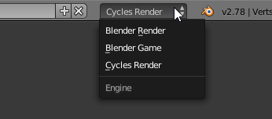
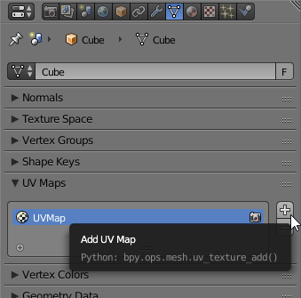
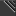
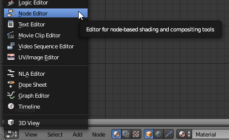
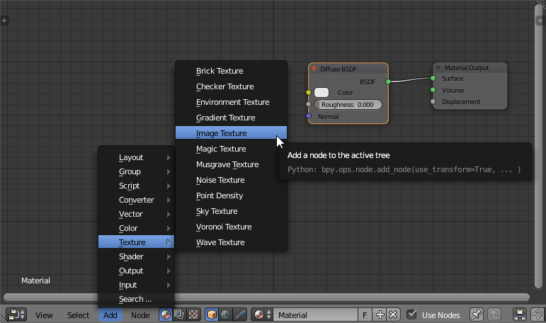
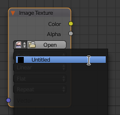
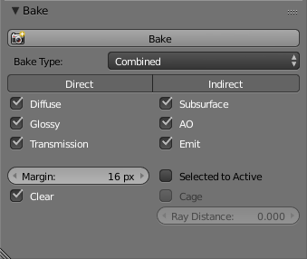
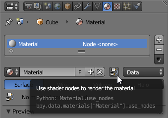

## Baking lighting to lightmaps with Blender

The AltspaceVR SDK does not include real-time lighting support, so you need to generate ("bake") a texture that applies the same effect. The steps below describe the general process of creating this texture in Blender.

1. Switch rendering mode to "Cycles Render".

	

2. Load your model into Blender, or create it from scratch.

3. Switch your materials to use nodes through the material properties editor if they don't already use them.

4. Add lights to your scene, until you are satisfied with the way the rendered version is lit.

5. Create the mesh's UV map and texture like normal.

6. Create a second set of UVs by duplicating the first set, and select the second set.

	

7. If your UV map extends past the bounds of the texture, or triangles overlap, then remap the mesh so these criteria are met. Make sure at least two (recommended four) pixels separate your triangles at your texture resolution, or the edges will "bleed" in AltspaceVR.

8. Create a new blank texture of the resolution desired for your light map from the UV/Image Editor. For performance, smaller is better. 512x512 is typically large enough for medium-sized objects like furniture.

9. Open up the Node Editor. You can split up your window into multiple views by using the drag handles ().

	

10. If your "Diffuse BSDF" node has a linked texture already, detach it, and set the diffuse color to solid white.

11. Add an image texture node.

	

12. Set this texture's image to the blank texture you created before.

	

13. With the mesh selected, and the texture node linked to your blank texture selected, go to the Bake section from the Render Properties panel, and click Bake.

	

14. After the bake finishes, your blank texture should now contain your mesh's baked lighting. Save the texture to a file.

15. Switch the render mode back to "Blender Render", deactivate shader nodes on your materials, and hook back up the diffuse texture. Don't bother linking the light map you saved earlier, it won't be exported with the mesh.

	

16. Export your mesh to a model format that supports multiple UV maps, either Collada or glTF.

17. Load your model into your app using either A-Frame or Three.js.

18. Load your light map texture using `THREE.TextureLoader` or `<a-assets>`, and assign it to your mesh material's `lightMap` property.

	```javascript
	AFRAME.registerComponent('lightmap', {
		schema: {type: 'src'},
		update: function()
		{
			var self = this;
			var loader = new THREE.TextureLoader();
			loader.load(this.data, function(texture){
				self.object3DMap.mesh.material.lightMap = texture;
				texture.flipY = self.object3DMap.mesh.material.map.flipY;
			});
		}
	});
	```
